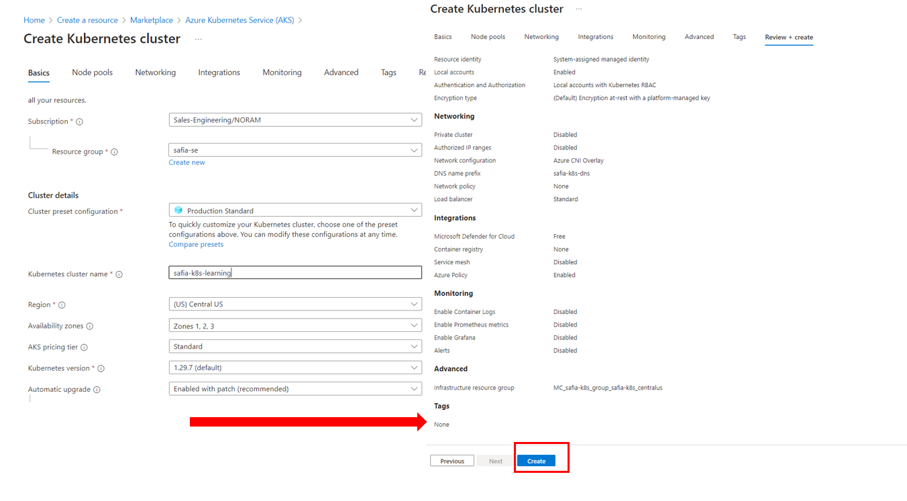
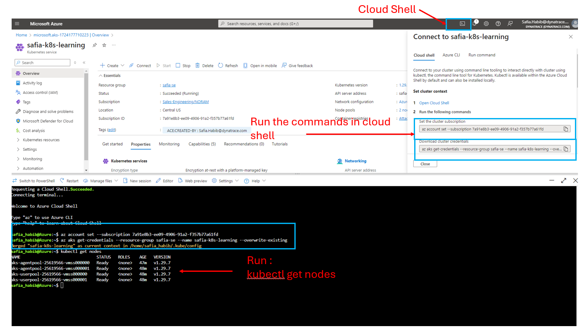
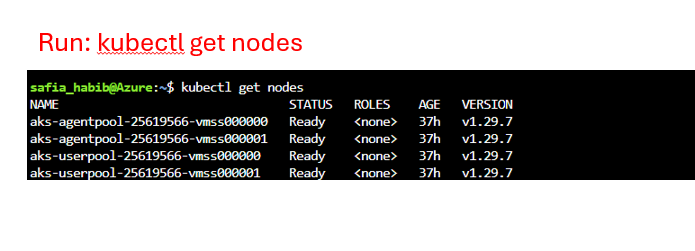
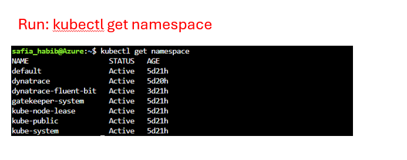

# Getting started with Dynatrace on K8s

## Exercise 1: Create a K8s cluster in Azure
1. Go to Azure Portal and search for Kubernetes services [here](https://portal.azure.com/#home)
2. Create a new Kubernetes service by providing all the details:

3. Connect to the Kubernetes cluster once it is created. Open the Cloud shell and run the commands to connect to the cluster

4. Once connected to the cluster run the following commands to aqauint with K8s components:

View the nodes in the K8s cluster, read more about nodes [here](https://kubernetes.io/docs/concepts/architecture/nodes/)
``````
kubectl get nodes
``````


View the namespaces in the K8s Cluster, read more about namespaces [here](https://kubernetes.io/docs/concepts/overview/working-with-objects/namespaces/)
``````
kubectl get namespace
``````


## Exercise 2: Installing Dynatrace Operator 
1. In your Dynatrace Environment go to Kubernetes app
2. Select Add Cluster
3. Select AKS in the Distributions list , Generate the tokens and download the dynakube.yaml file and make it available on the Azure Cloud shell
[Installing the operator](images/Ex2-Install-Operator-Commands.png)

4. Run the Operator install, read more about what is installed [here]()
``````
helm install dynatrace-operator oci://public.ecr.aws/dynatrace/dynatrace-operator `
--create-namespace `
--namespace dynatrace `
--atomic
``````

5. Once the Operator and its components are installed apply the dynakube file:
``````
kubectl apply -f dynakube.yaml
``````
[Applying Dynakube](images/Ex2-Apply-Dynakube.png)

## Exercise 2a: Observe the Dynatrace components installed in K8s through the operator: 

``````
kubectl get pods -n dynatrace
```````
[Dynatrace Deployed Pods](images/Ex2-Dynatrace-Deployed-Pods.png)

``````
kubectl logs --tail=20 <podname> -n dynatrace
``````
[Dynatrace Operator logs](images/Ex2a-Dynatrace-Operator-Logs.png)
[Dynatrace Activegate Logs](images/Ex2a-Dynatrace-ActiveGate-logs.png)

## Installing Fluent Bit and shipping logs to Dynatrace 
From the Dynatrace installation wizard generate the Fluent bit values file (used for enrichment of the logs to the cluster)
[Dynatrace Installation overview for Fluent Bit](images/Dynatrace-Install-Fluent-Bit.png)

1. Add Fluent Bit Helm chart

``````
helm repo add fluent https://fluent.github.io/helm-charts
``````

2. Update the helm charts: 

``````
helm repo update
``````
[Adding the Fluent Bit Helm chart](images/Fluent-Bit-Helm-Chart.png)
3. Install Fluent bit with the values file that you obtain from the Dynatrace Kubernetes Install wizard: 

``````
helm install fluent-bit fluent/fluent-bit -f fluent-bit-values.yaml `
--create-namespace `
--namespace dynatrace-fluent-bit
``````
[Install Fluent Bit Helm chart](images/Installing-Fluent-Bit-Helm-Chart.png)
4. Check the logs of Fluent bit pods: 

``````
kubectl get pods -n dynatrace-fluent-bit
kubectl logs --tail=20 <podname> -n dynatrace-fluent-bit
``````
[Check Fluent Bit pods, logs](images/Check-FluentBit-Pods-logs.png)

## Ingest Prometheus metrics into Dynatrace
Run the following commands on your Kubernetes cluster:

1. Create an API token with Ingest metrics permissions within Dynatrace tenant and replace the values of tenant and API Token: 

``````
   kubectl create secret generic dynatrace-otelcol-dt-api-credentials --from-literal=DT_ENDPOINT=https://<tenant>.live.dynatrace.com/ --from-literal=DT_API_TOKEN=dt0c01.T2JTCLQUKJN4FER4LHEUQSTG.XXXXYYYYZZZ
``````

2. Download the cert Manager:

```js
  kubectl apply -f https://github.com/cert-manager/cert-manager/releases/download/v1.14.4/cert-manager.yaml
```

3. Download Opentelemetry operator

```js
  kubectl apply -f https://github.com/open-telemetry/opentelemetry-operator/releases/latest/download/opentelemetry-operator.yaml
```

4. Add the Otel Helm Charts:

```js
helm repo add open-telemetry https://open-telemetry.github.io/opentelemetry-helm-charts
helm repo update
```

5. Provide the details of what to import within Dynatrace using the values-deployment.yaml

```js
  helm upgrade -i dynatrace-collector open-telemetry/opentelemetry-collector -f values-deployment.yaml
```


## Adding Istio and Envoy


